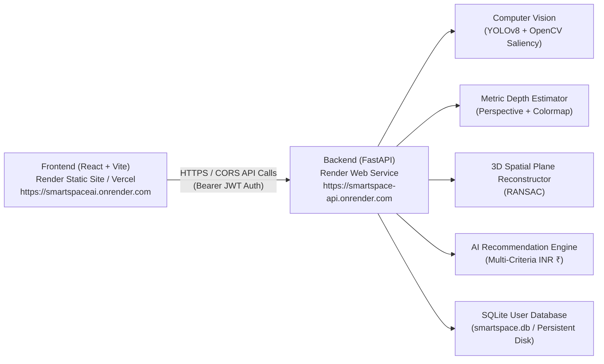

# SmartSpace AI — Production Deployment Guide

This guide provides end-to-end instructions for deploying the **SmartSpace AI** full-stack platform (FastAPI Python backend + React Vite frontend) to **Render** (or Vercel / Netlify).

---

## Architecture Overview



---

## Step-by-Step Deployment Instructions

### STEP 1 — Push Project to GitHub

1. Initialize git repository if not already initialized:
   ```bash
   git init
   git add .
   git commit -m "feat: prepare SmartSpace AI for production deployment"
   ```
2. Create a new GitHub repository (e.g. `smartspace-ai`) and push:
   ```bash
   git remote add origin https://github.com/YOUR_USERNAME/smartspace-ai.git
   git branch -M main
   git push -u origin main
   ```

---

### STEP 2 — Deploy Backend to Render

1. Log in to [Render Dashboard](https://dashboard.render.com).
2. Click **New +** → **Web Service**.
3. Connect your `smartspace-ai` repository.
4. Configure the service settings:
   - **Name**: `smartspace-backend`
   - **Region**: Choose the closest region (e.g., `Singapore`, `Frankfurt`, `Oregon`)
   - **Root Directory**: `backend`
   - **Runtime**: `Python 3`
   - **Build Command**: `pip install -r requirements.txt`
   - **Start Command**: `uvicorn main:app --host 0.0.0.0 --port $PORT`
   - **Instance Type**: `Free` (or `Starter` for dedicated CPU/RAM)

---

### STEP 3 — Set Backend Environment Variables

In the Render Web Service **Environment** tab, add the following environment variables:

| Variable Key | Suggested Value | Description |
| :--- | :--- | :--- |
| `PYTHON_VERSION` | `3.11.9` | Matches tested Python 3.11 runtime |
| `HOST` | `0.0.0.0` | Listens on all network interfaces |
| `SMARTSPACE_JWT_SECRET` | *[Generate 32+ char random string]* | Cryptographic secret for signing JWTs |
| `FRONTEND_URL` | *[Your Frontend URL from Step 6]* | e.g. `https://smartspace-frontend.onrender.com` |
| `SMARTSPACE_DB_PATH` | `smartspace.db` (or `/data/smartspace.db`) | SQLite database file location |
| `INITIAL_ADMIN_EMAIL` | `admin@smartspace.ai` | Default Administrator login email |
| `INITIAL_ADMIN_PASSWORD` | `Admin@12345` (change in prod) | Default Administrator initial password |
| `INITIAL_RESEARCH_EMAIL`| `research@smartspace.ai` | Default Researcher login email |
| `INITIAL_RESEARCH_PASSWORD`| `Research@SmartSpace2026!` | Default Researcher initial password |
| `INITIAL_USER_EMAIL` | `user@smartspace.ai` | Default Demo User login email |
| `INITIAL_USER_PASSWORD` | `User@SmartSpace2026!` | Default Demo User initial password |

Click **Save Changes**. Render will automatically build and start your FastAPI service.

---

### STEP 4 — Obtain Backend HTTPS URL

Once deployment completes, copy your live backend URL from the Render dashboard:
> `https://smartspace-backend-xxxx.onrender.com`

Verify it is running by opening:
`https://smartspace-backend-xxxx.onrender.com/health`

Expected JSON response:
```json
{
  "status": "ok",
  "service": "SmartSpace AI Backend",
  "phase": "Phase 6 - AI Recommendation Engine",
  "features": [
    "computer_vision",
    "depth_estimation",
    "ransac_plane_fitting",
    "spatial_reconstruction",
    "ai_recommendation_engine",
    "budget_optimization_inr"
  ]
}
```

---

### STEP 5 & 6 — Deploy Frontend

#### Option A: Render Static Site (Recommended)

1. On [Render Dashboard](https://dashboard.render.com), click **New +** → **Static Site**.
2. Connect the same `smartspace-ai` repository.
3. Configure the static site:
   - **Name**: `smartspace-frontend`
   - **Root Directory**: `frontend`
   - **Build Command**: `npm install && npm run build`
   - **Publish Directory**: `dist`
4. In the **Environment** tab, set:
   - `VITE_API_BASE_URL` = `https://smartspace-backend-xxxx.onrender.com`
5. In **Redirects / Rewrites** tab:
   - **Source**: `/*`
   - **Destination**: `/index.html`
   - **Action**: `Rewrite` (ensures React Router SPA navigation works on refresh)
6. Click **Create Static Site**.

#### Option B: Vercel / Netlify
1. Import `frontend` directory.
2. Build Command: `npm run build`
3. Output Directory: `dist`
4. Environment Variable: `VITE_API_BASE_URL` = `https://smartspace-backend-xxxx.onrender.com`
5. Single Page Application rewrite rule: `/* -> /index.html`

---

### STEP 7 — Configure CORS on Backend

After obtaining your frontend URL (e.g. `https://smartspace-frontend-yyyy.onrender.com`):
1. Go back to your backend Render Web Service → **Environment**.
2. Update `FRONTEND_URL` to your live frontend URL:
   ```env
   FRONTEND_URL=https://smartspace-frontend-yyyy.onrender.com
   ```
3. Click **Save Changes** (triggers quick restart).

---

## Verification & Smoke Testing Checklist

### 1. Test `/health`
- Request: `GET https://smartspace-backend-xxxx.onrender.com/health`
- Expect: HTTP 200 `{"status": "ok", ...}`

### 2. Test Authentication
1. Open frontend website in browser.
2. Navigate to **Login** (`/login`).
3. Log in with default Admin credentials:
   - Email: `admin@smartspace.ai`
   - Password: `Admin@12345`
4. Confirm successful redirection to Dashboard with JWT session active.

### 3. Test Camera & Computer Vision Analysis
1. Navigate to **Camera Workspace** (`/camera`).
2. Upload a sample room image (JPG/PNG).
3. Set room dimensions (e.g., $4.8\text{m} \times 3.6\text{m} \times 2.8\text{m}$) and style.
4. Click **Run Spatial Reconstruction**.
5. Verify:
   - Image quality metrics appear.
   - Detected furniture objects list appears with confidence scores.
   - Colormap depth map visualization renders.
   - 3D bounding coordinates are calculated.

### 4. Test Monocular Depth Estimation
- Verify the depth colormap in analysis results showing perspective distance gradient.

### 5. Test AI Recommendations
1. Navigate to **Recommendations** (`/recommendations`).
2. Verify synthesized interior design proposals with match scores, cost optimization, and explainable AI breakdown (XAI).

### 6. Test Design Studio & Interactive Customizer
1. Navigate to **Design Studio** (`/studio`).
2. Select style (e.g. **Scandinavian** or **Modern**).
3. Change **Wall Color** (e.g. *Sage Green*) → verify live canvas wall updates immediately.
4. Change **Floor Material** (e.g. *Oak* or *Marble*) → verify floor updates immediately.
5. Change **Ceiling Color** (e.g. *Warm White*) → verify ceiling boundary updates.

### 7. Test Furniture Catalog & Staging ("Add to Room")
1. In Design Studio, click **Browse Catalog** / open catalog.
2. Click **`+ Add to Room`** on *Nordic Low-Profile 3-Seater Sofa*.
3. Verify the sofa appears immediately inside the 2D floor plan & 3D canvas at valid room coordinates.
4. Button changes to `✓ Added` with `Remove` option.
5. Adjust position with nudge buttons (`←`, `→`, `↑`, `↓`) and sliders.
6. Rotate ($90^\circ$) and adjust scale.
7. Switch between **Floor Plan (2D)** and **3D Preview**.

### 8. Test Design Summary & Save / Reopen
1. Check **Design Summary** tab: verify total cost and budget balance update dynamically.
2. Click **Save Design** → verify success toast.
3. Navigate to **Project History** (`/history`) and reopen project → verify all customizations and positions are restored with 100% fidelity.

### 9. Test Admin Console & Research Portal
1. Navigate to **Admin Console** (`/admin`) → verify user management and telemetry.
2. Navigate to **Research Portal** (`/research`) → verify benchmark datasets and CV performance metrics.

---

## Production Storage & Database Considerations

> [!IMPORTANT]
> - **SQLite Database (`smartspace.db`)**:
>   - On Render Free Tier, filesystem storage is ephemeral (resets on container restart).
>   - The backend includes automatic idempotent startup seeding via `seed_default_accounts()`, ensuring admin, researcher, and user credentials work permanently on every restart.
>   - For permanent database retention across redeploys without re-seeding, attach a **Render Persistent Disk** mounted at `/data` and set `SMARTSPACE_DB_PATH=/data/smartspace.db`.
> - **User Projects & Design Customizations**:
>   - User room customizations and projects are persisted in browser `localStorage` via `ProjectContext`, ensuring zero data loss during user sessions regardless of backend instance restarts.
